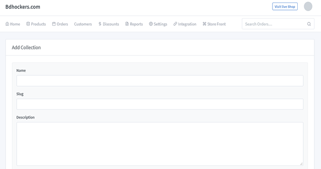
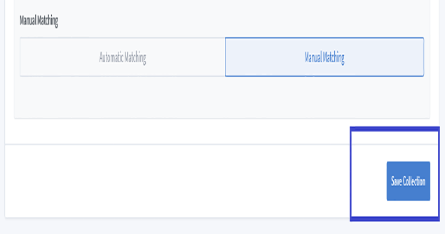

# Collection Documentation

> Every eCommerce solution needs a category section so that people can easily find a specific product. All the categories or subcategories are usually classified by the product and services in one place.

Adding proper categories improves the internal search and usability and results in a better customer experience. Make sure your categories include quality images, price tags, ratings, titles, and descriptions so that it becomes easy for your customers to get all the details. You need to find out what the customer wants, then add categories accordingly. Click on **"Products => Collections"** to create a new collections.Here are the steps you can follow to add a category :

- Editing existing product categories in e-commerce 

- Automatic matching and Manual matching

You will get to edit or update your category as needed. Just go to the category list and click the edit button.

