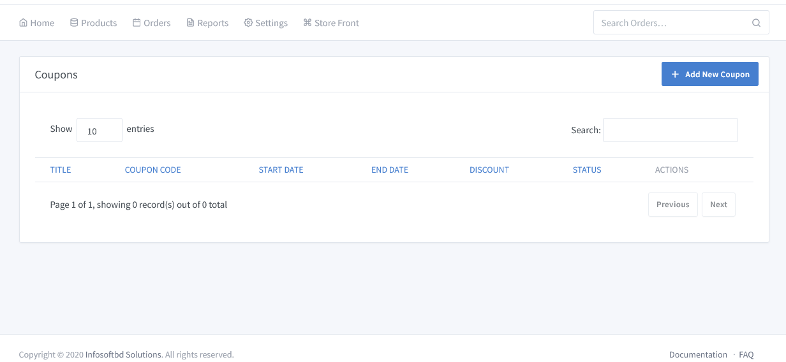
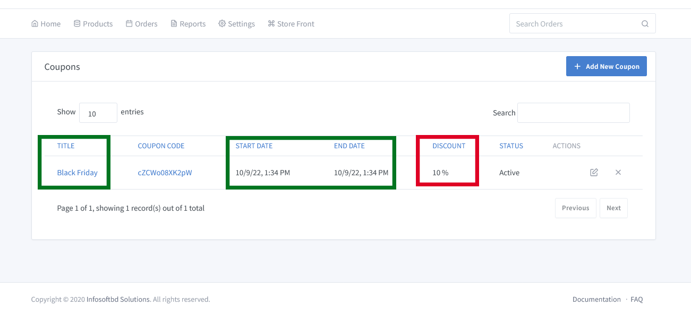

# Coupon Management

> Coupons are a great way to offer discounts and rewards to your customers, and can help promote sales across your shop.

**Add Coupoun**: To create a new coupon, first go to **"Products => Discount/Promotion"** to create an offer for your customer for a specific product.

A new discount offer has been created for **Black Friday** . It specifies the amount of the **Discount Offer** as well as the **Start to End Date**.

**Advantages of the Promotional offer**

- They help create your online store’s reputation.

- They promote word-of-mouth marketing.

- They increase your e-commerce traffic

- They help and convert new customers.

- They convey credibility and security.

