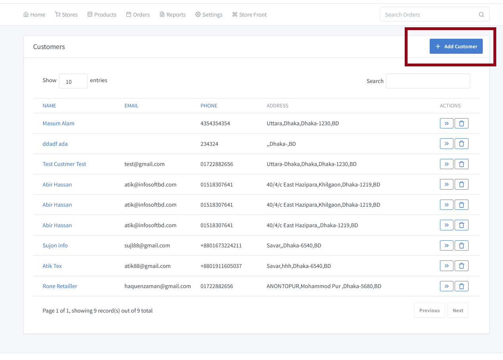
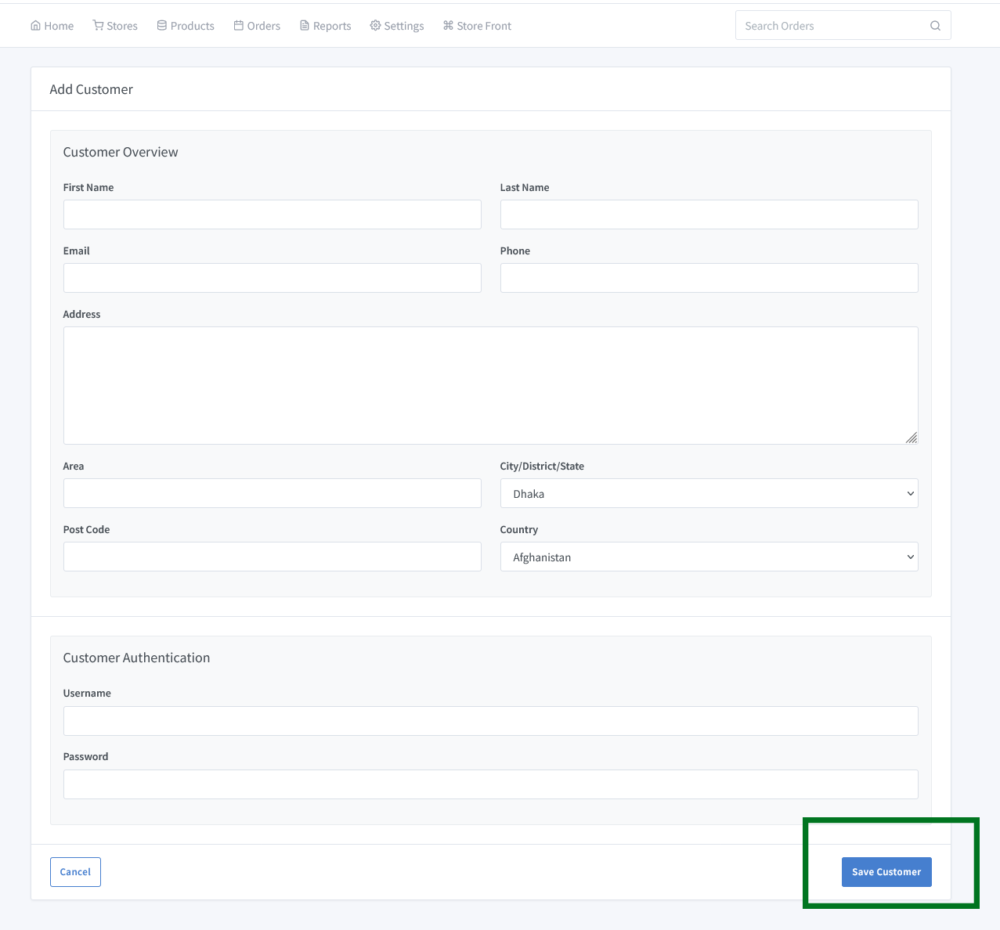

# Customer Profile Add

To add a new customer, first navigate to **Order->All Customers**. Click the **Add Customer** button on the right side. A new window will appear in front of you where you can see the list of customers' profiles being placed.To clarify, follow the below image.

A new page will come up to fill up some basic infomation like name, address etc then click to **Save Button** to save the customer informatio for further use.

You will get to edit or update your customer as needed. Just go to the customer list and click the edit button.