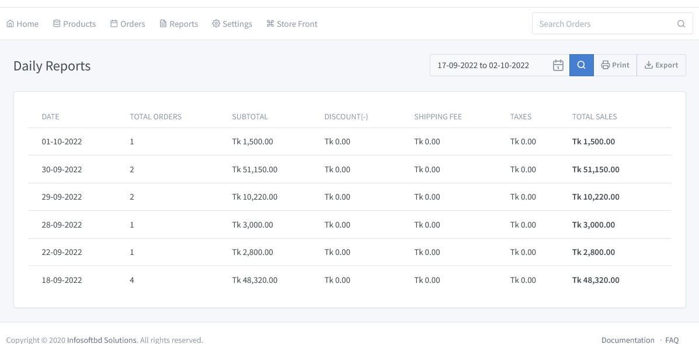

# Daily Reports 

Go to the solution dashboard and click on **"Reports => Daily Reports"**. You can sort by date to see the day-wise total sales.

We can easily search how many payments have been made and how many sales have been made against order ID in a single days. You can print a daily sales report,daily payment report, and those can be downloaded easily if you want.
