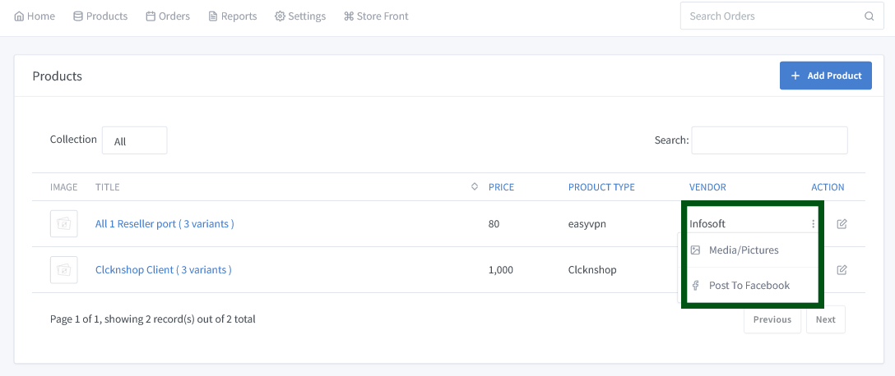
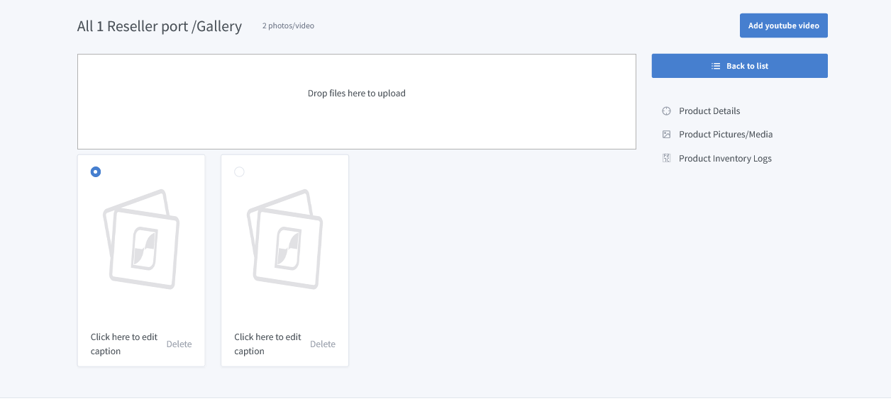
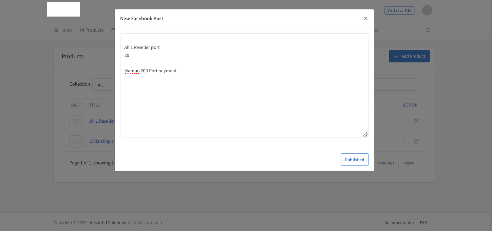

# Upload Picture/Post to Facebook from **Product**

Go to the dashboard and click on "Products => All Products" to see the list of products. Click the right side **...** to view the uploaded image for each product and post to Facebook here.
There are some steps to adding picture and post to Facebook.

# Step -1: Upload Picture

# Step -2: Post to Facebook

