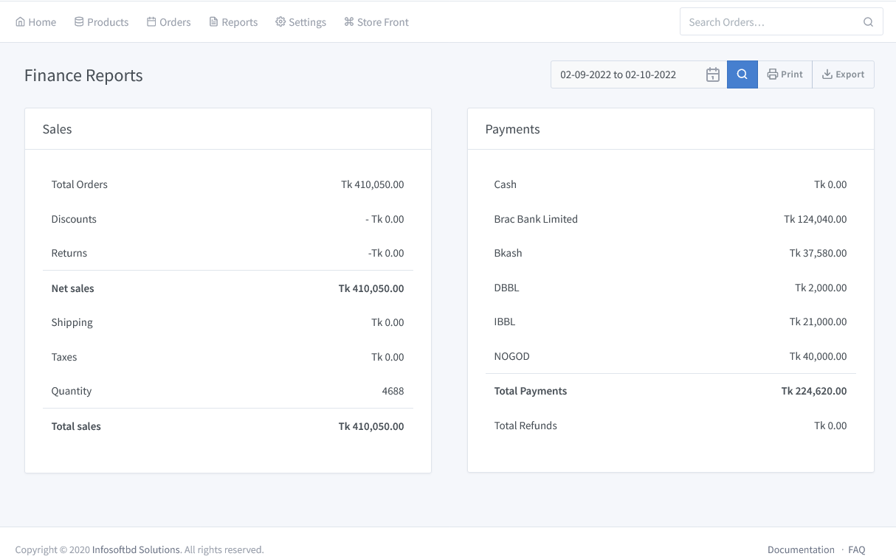

# Financial Report

> Get better understanding of your website sales with just have a brief look at the sales report by order placement.

Go to the solution dashboard and click on **"Reports => Financial Reports"**. You can sort by date to see the total financial amount. For example, you will see a financial order on a full month, half month,weekly basis, or day-to-day basis.

We can easily search how many payments have been made and how many sales have been made in a single month. You can print a monthly sales report, a monthly payment report, and those can be downloaded easily if you want.

