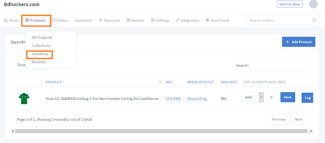

# Inventory Management Documentation

>Inventory management is a system to help retailers grow in every aspect of their business.Ecommerce retailers need to have a few things to be successful: a functional and appealing website, a good shipping strategy, and visibility into their inventory counts and locations.

Inventory management helps you keep track of your products that are readily available to you at any given time. You can access your inventory at any time and keep track of the products you have in stock.

- Step-1: How to access inventory?

	Go to the solutions dashboard and click on **"Products => Inventory"**. From there, click on the **'Inventory'** option. A new window will open where you will see a list of all the products in your stock along with their numbers.

   

- Step-2: How to add and set new items to your stock?

	Select the **"Add"** menu of the product you want to increase stock of and enter the number you want to add and click the **"Save"** button. The following images will help you understand:

   

