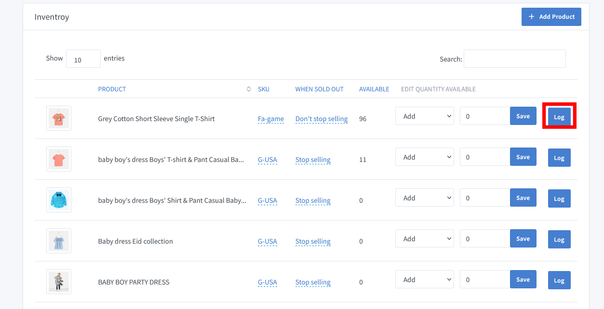
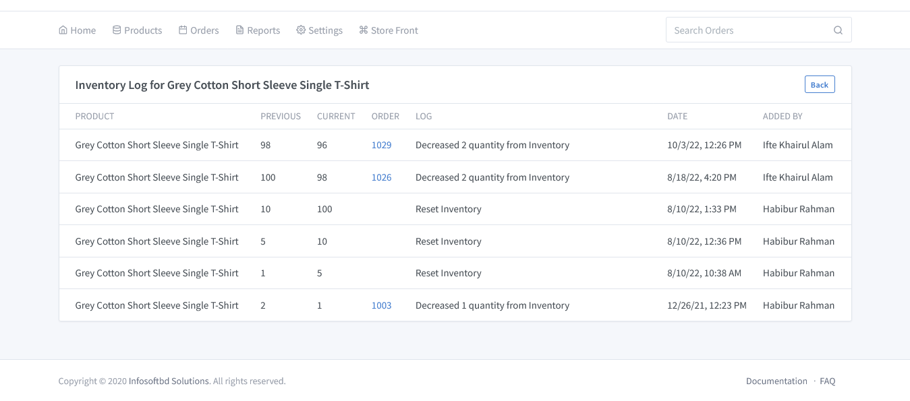

# Inventory Log Documentation

Go to the dashboard and click on **"Products => Inventory"**. A new window will appear in front of you where you can see the product that you have created. From the right side, click the log button in the product list.

By clicking on any **LOG Button**, you can see the details for each product.Which product quantity increased or decreased? Also see who added all the information? Also, you see the current quantity as well as the previous quantity according to date-time and order ID.
