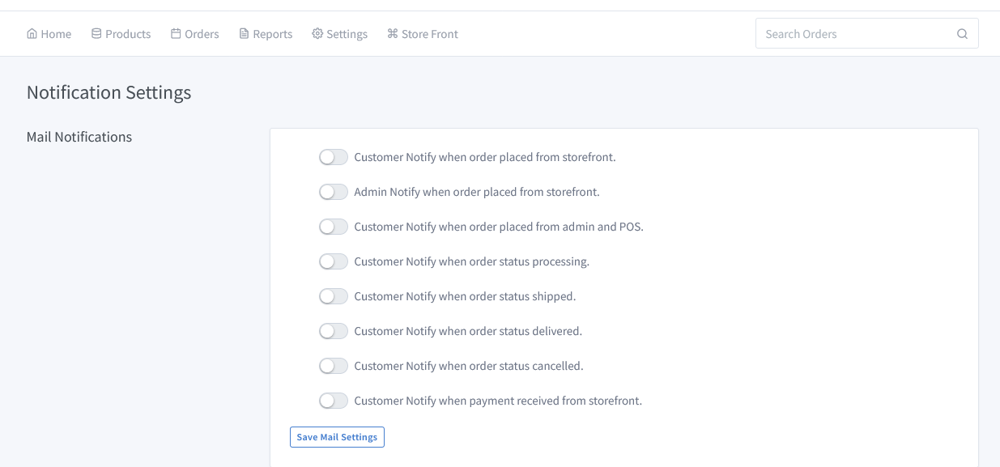
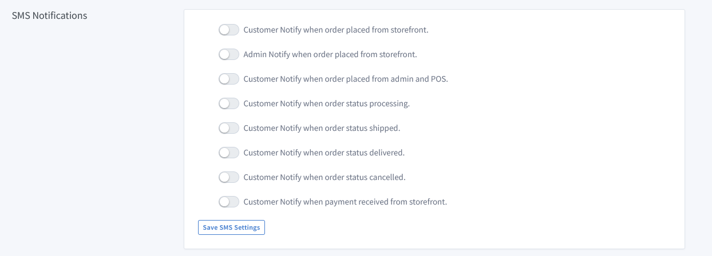
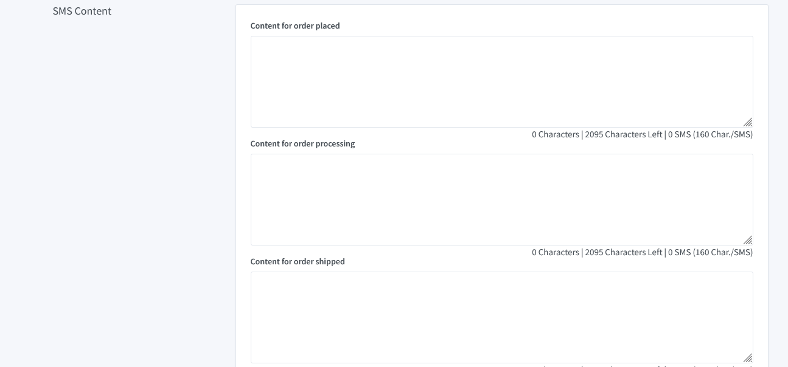

# Notification DocumentW

Go to the dashboard and click on **"Settings => Notifications".** To set notification for all valuable customers or a specific product for a specific customer.

You can set all the notifications to send mail to your customer to process the order, such as content for order placed, content for order processing, content for order shipped, content for order delivered, content for order cancelled,etc.

You can set all the notifications to send SMS to your customer to process the order, such as content for order placed, content for order processing, content for order shipped, content for order delivered, content for order cancelled, etc.

You can make SMS content for order processing, content for orders shipped, content for orders delivered, and content for orders cancelled according to order ID.
Example : Dear Customer, Percel from Bdhockers.com  your Order ID 1XXX is placed.Your order is placed. Thank you.
