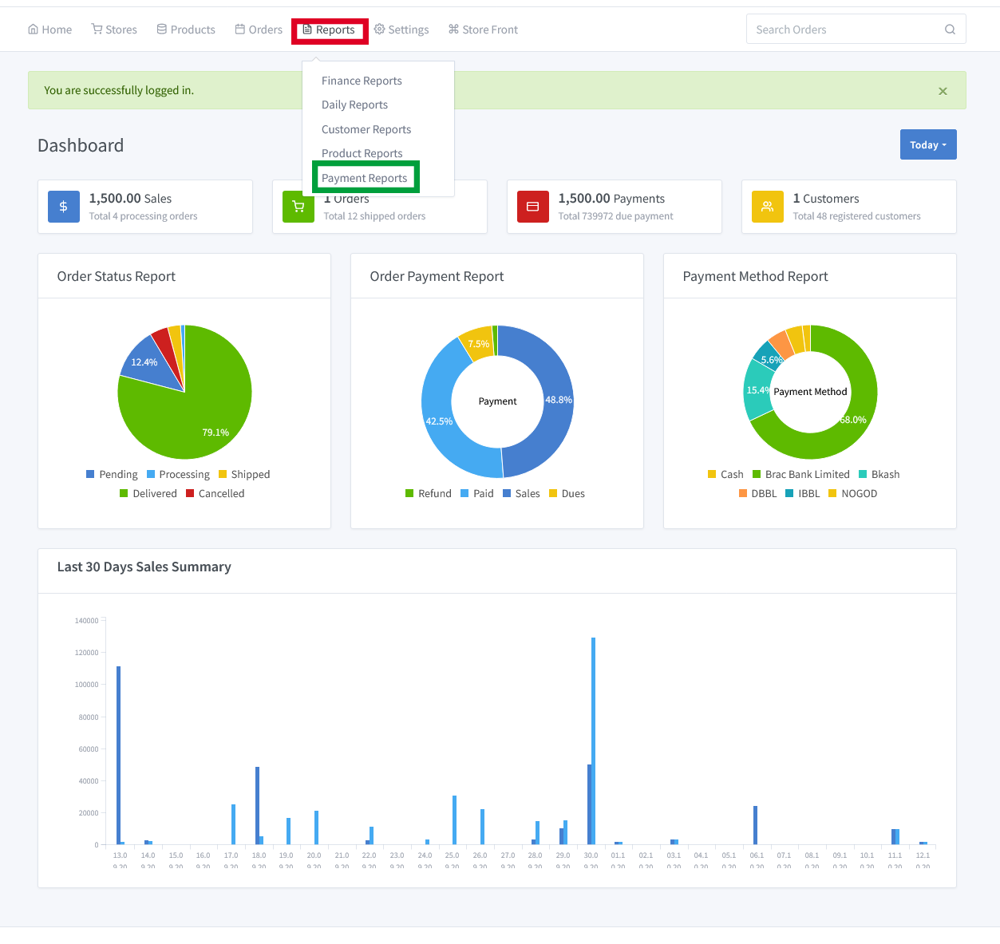
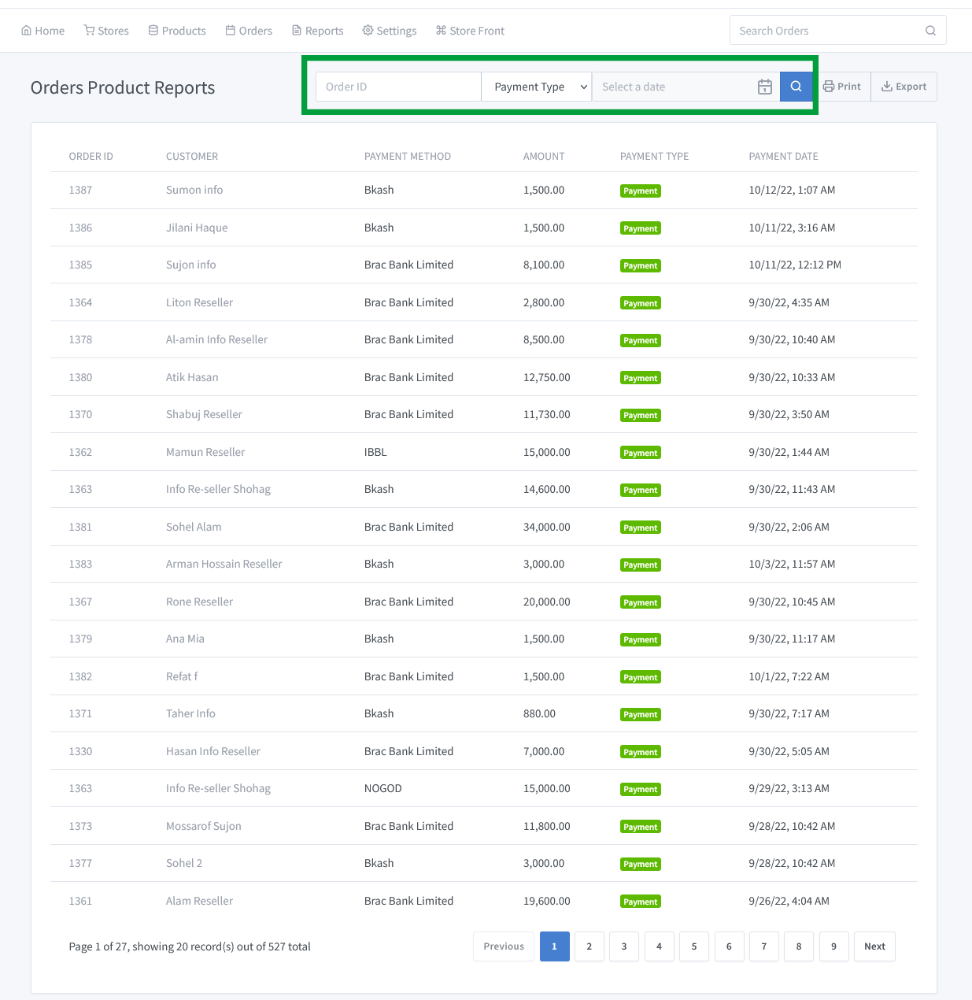

# Order Payment Report

Go to the smart dashboard and click on **"Reports => Order Payment Reports"**.A new window will appear in front of you where you can see the order payment list according to order ID. You also see the customer name,payment method,amount,payment type, and payment date.

There is two payment type :

- Payment 
- Refund

We can easily search how much payment has been made and how much payment has been refunded against Order ID in a single month.You can print a monthly order payment report and also download it easily if you want.

