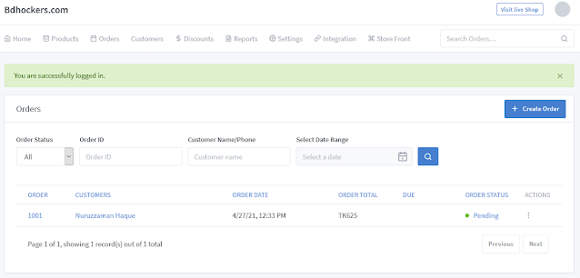
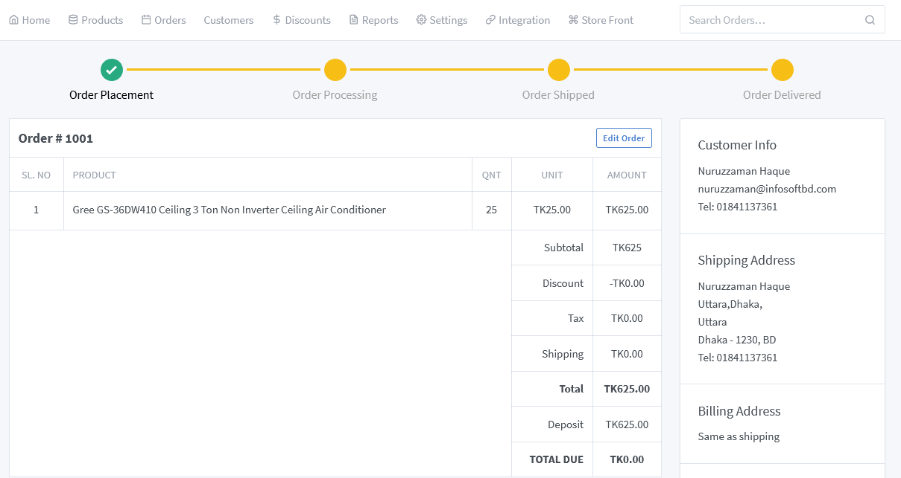
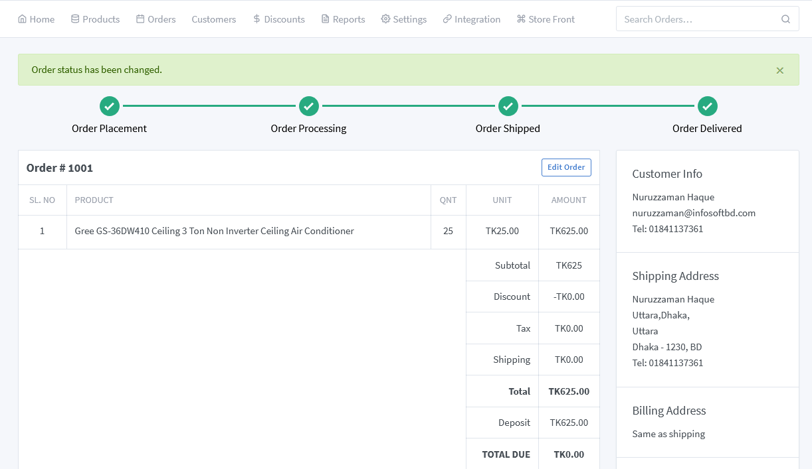

## Order management

>Order management for Add/Edit and manage orders

**Add order:**
To create a new order first goto **Order -> All orders**. From the right side click **Create Order** button. 
After create orders page come first browse the products to add in the order or You can add a custom-based product to the order.A new window will appear in front of you where you can see the list of orders being placed.

By clicking on any Order ID, you can see the details of the order and whether the customer's information is correct.
<!-- 
 -->

**What are the steps in order processing?**

For customers, once they hit the "Buy Now" button, the hard work is over. All they’ve got to do is sit back and wait for those to arrive on their doorstep.

But if you’re an ecommerce business, that’s where the hard work truly begins. Each new order sets off a complex chain reaction—from accepting the payment through to picking, packing and finally shipping it to the right place.

If the order is going to the shipment or delivery stage, there is no chance to cancel it. At the stage of order placement and processing, he or she can cancel the order.