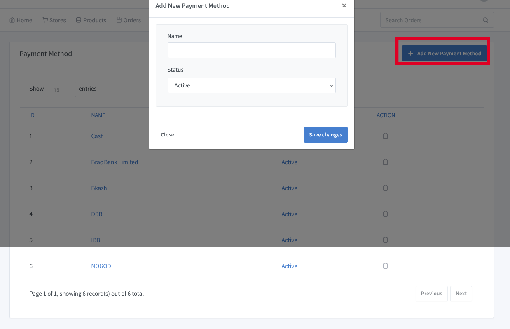

# Payment Methods Documentation

> What’s the very first thing you look for in an online store when making a purchase? Payment options are available. While some of us prefer online banking, there are also those who’d rather choose cash on delivery for their orders. But as a store owner, how do you ensure that you’re catering to all types of customers and their payment preferences?

Go to the solution dashboard and click on **"Settings => Payment Method"** to add different kinds of payment methods manually.Different types of payment gateways are integrated according to user requirements.

What are the different types of payment modes? 

Our solutions accept all popular payment methods from around the world.

- Paypal

- Credit cards including Visa, Mastercard, American Express.

- TransferWise, Payoneer, Tipalti.

- More .. 

It seems like a lot of things to implement. Well, if your store is on our solutions, it’s easy to offer them all. Here’s how!

How do you add multiple payment methods to your online store?

- Enabling netbanking/ debit card/ credit card/ UPI 

- Setting up cash on delivery 

  > **Cash On delevery:** Cash on delivery (COD), also known as “collect on delivery” and “cash on demand,” is a payment method in which customers don’t pay for mailed goods until they’ve received and decided to keep them.