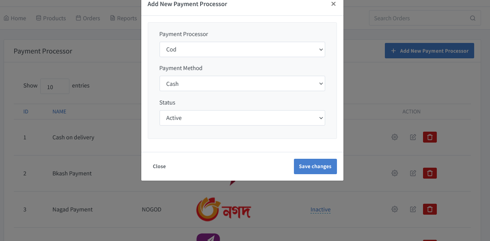

# Add Payment Gateway

> To accept electronic payments and be able to process credit or debit cards, a merchant uses a payment gateway.

Go to the solution dashboard and click on **"Settings => Payment Processor"** to implement different kinds of online payment gateway.

