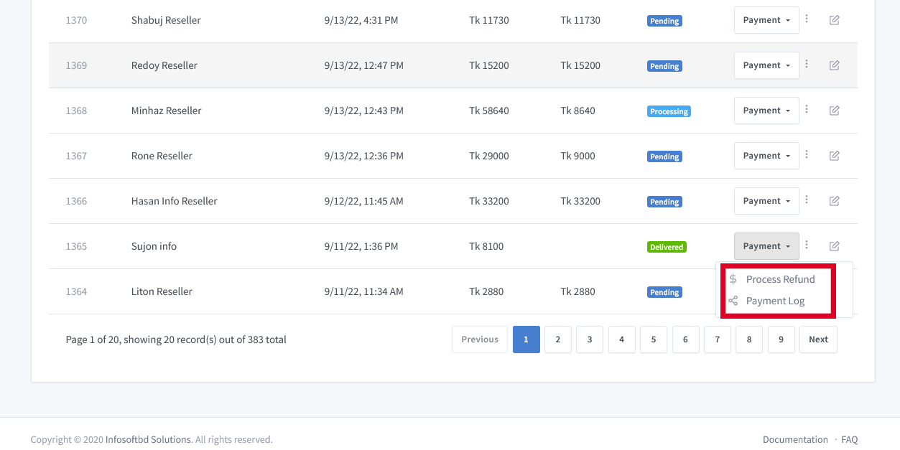
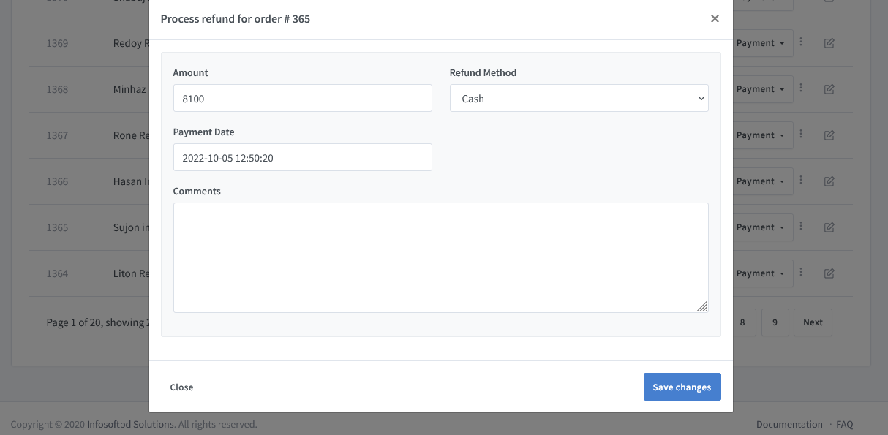
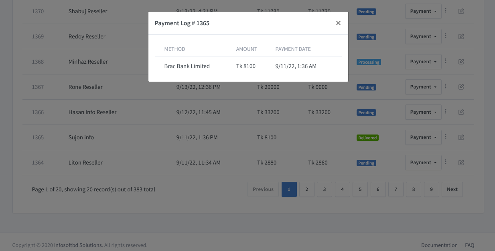

# Payment Refund/Payment Log

>A returns policy is a statement which stipulates under which circumstances a retailer is willing to accept previously purchased products returned by the customer

**Payment Refund Process:**

With today’s sophisticated consumer, who are becoming increasingly fickle by nature (and with the sheer volume of retailers at their disposal, they can afford to be), only the best level of customer service will do. This includes having a favourable returns policy which is deemed as of the most important factors when making a purchasing decision. 

Select on the **Refund** to see the image as same as below.

**Payment Log:**

By the log, we see how much time was paid against the single order. Also show the payment method ,amount, and date/time.

