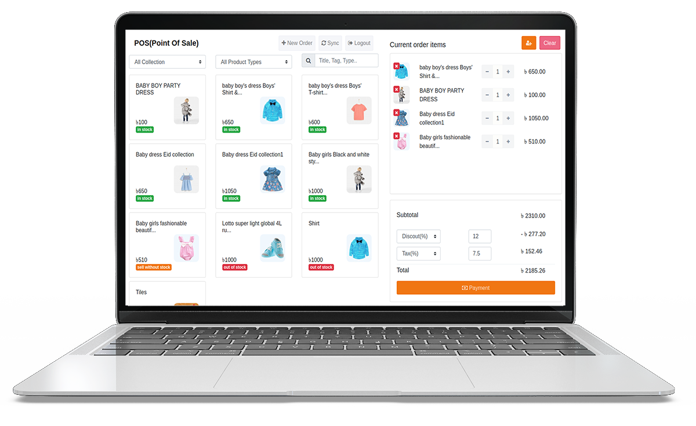

# POS Documentation

> “Integrating your POS and ecommerce site means having one holistic view of your customers and business. Inventory, orders, gift cards, images — all of these and more sync, offering your customers a seamless omnichannel shopping experience and your team a 360-degree view of your sales performance and customer journey.”

Go to the solutions dashboard and click on **"Products=> POS"** to see how orders are generated easily from POS as well as managed manually from storefront orders. 

Our solutions provides POS software for use by all types of retail outlets, variety stores, or supply companies for accounting, procurement, sales, and stock mechanization, as well as a customized payment gateway method for online transactions.Special Features our POS Software are :

- Orders: Generate orders and invoices easily from POS(Point Of Sale).

- Invoices : Generate and download invoices for your sales.

- Reports : Get your payments, products, customers reports according to required filters.

- Cash & Digital Payment : Receive payment from customers and track your cash and online payments.

