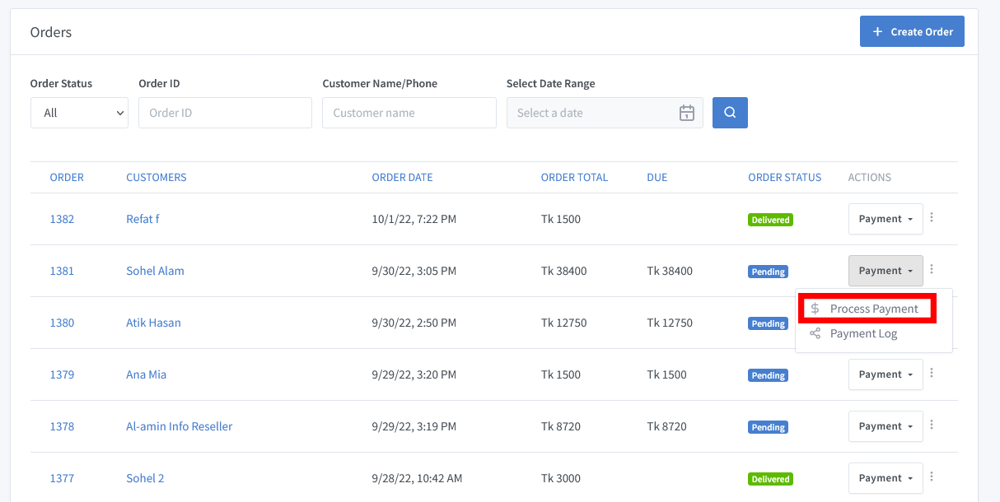
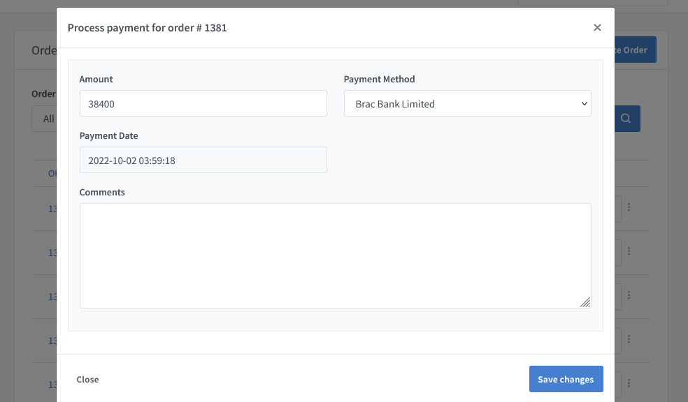

# Payment Process Documentation

Go to Solution Dashboard and click on **"Orders => All Orders"** to view the list of orders. Click on the dropdown to see the menu of each order. **Payment->Payment Process**.To clarify with an image below how to process a payment? 

When you select **Payment->Payment Process**, you'll be taken to a new window where you can process transactions for individual orders via a specific payment method.

