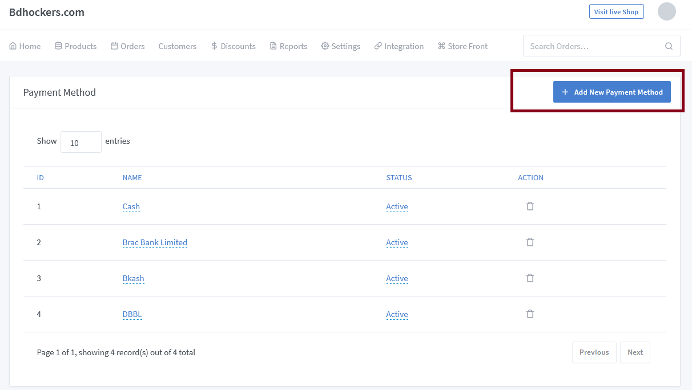

# Payment Method

> Customer have numerous payment method options when making online purchases. For businesses implementing e-commerce its important to understand the forms of payment that consumers use, and prefer, for online purchasing.

Go to the solutions dashboard and click on "Settings => Payment Methods" to add a new payment method and also add various kinds of payment gateway.

