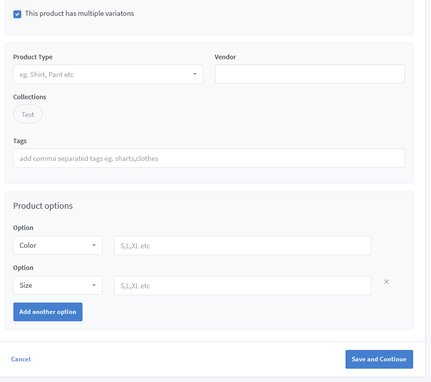
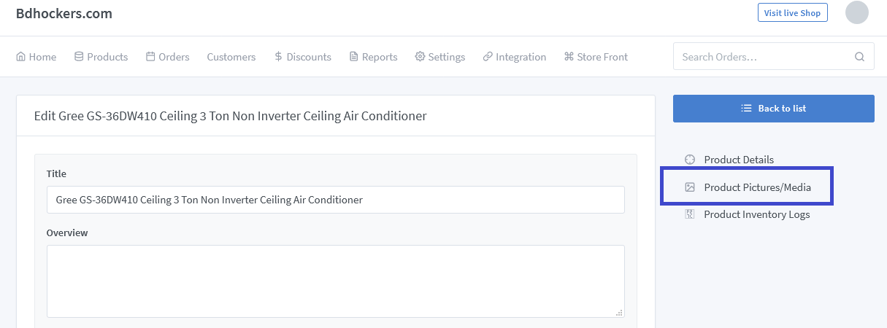

# Product Documentation

>One of the most appealing things about running an e-commerce solution is that you can add different products easily.

Go to the solutions dashboard and click on **"Products => All Products"** to create a new product. There are some steps to adding products.

<!-- You can add a product to the main page of your solutions, this is a great way to feature your products so that customers can easily click through to the product and purchase the item. You can add a product to the main pages of your solutions by using a product description,varient, buttons or images. -->

- Step-1: Go to the Products option where you want to add the product.

- Step-2:Click the Add button to create a product.

- Step-3: Fill up all the required fields in the product.

- Step-4: If you click on this check box under the slug box, "This product has multiple options," our website can create product variants for you. Now type in the type of variation you want to add in **"Product Option"**. Take, for example, "size". Go to "Option values" and add "Small", "Medium", "Large" etc. can do Some products may have more than one option. In that case, click on the **"Add Another Option"** button.

- Step-5: Click **"Save and Continue"**.

- Step-6: If you click on the save option with all the information about the product, the product list will appear. Then you can provide some pictures of the product.

You will get to edit or update your product as needed. Just go to the product list and click the edit button.

