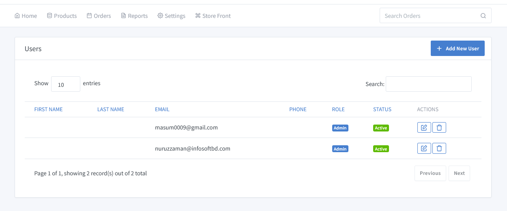
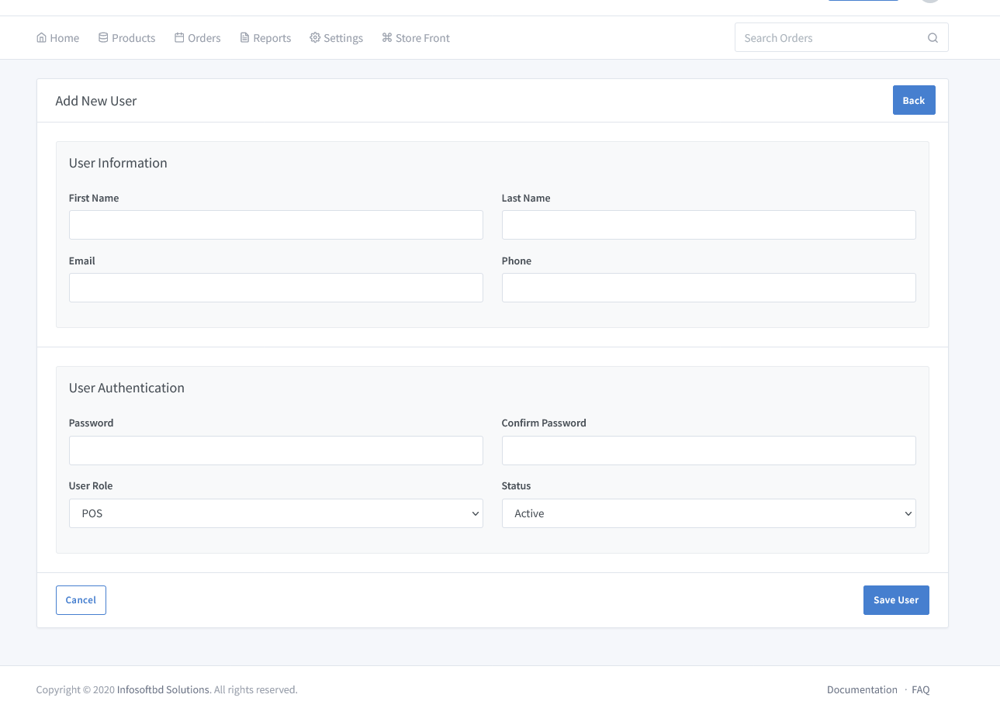

# User Profile Documentation

Go to the dashboard and click on **"Settings=> User Management"** to see how to create a new profile.There are two types of user role: one for admin and another for pos.

To click on "**Add new User**" button.Then fill up all the required fields to make a user profile.<!-- It is also possible to do so from the site's front page.Click on registration and then follow the rules. Then you would be a registered customer.You can check all your purchases from your own profile. -->

