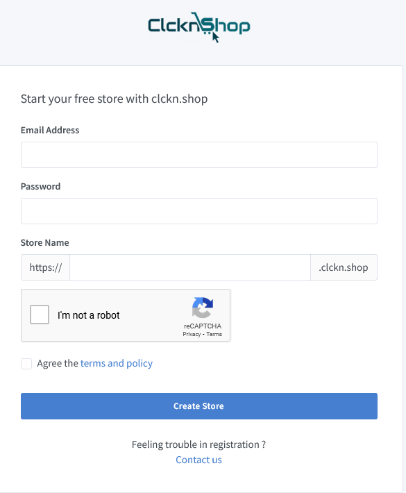
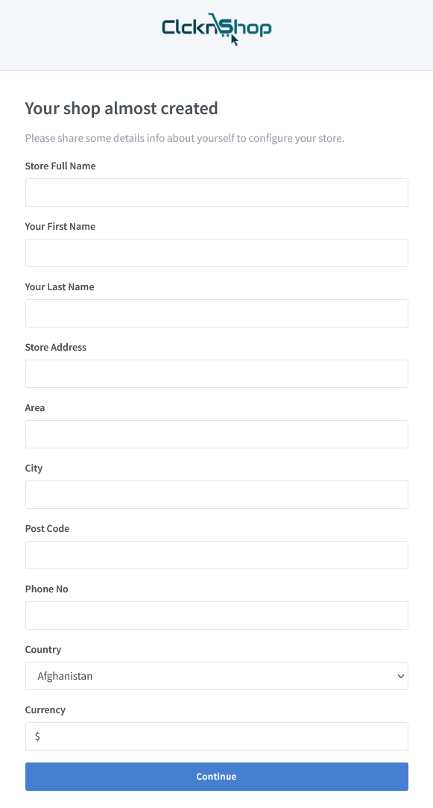

# Registration

>User first need to register to create a colud ecommerce solution

Please goto reistration page and fillup with following information

- Email address
- Password
- Store Name

After filling up all informations the cloud application will be ready. A new page will come up to fill up some basic infomation like name, address etc. After filling that form user will be redirected to admin dashboard of the cloud solution.

