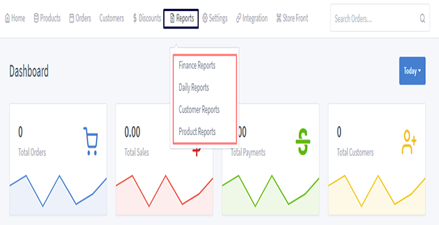

# Reports Documentation

> One of the important and interesting things about online business is that you can see everything in one click.

To check all reports, first go to the "Report" section. There are four types of reports our solutions provide. There is given description below.

- Finance reports -  Finance report includes all sales data.

- Daily reports - Daily total orders and payments data.

- Customer reports -  Customer based orders and accounting.

- Product reports - Product based reports with order and payments.

