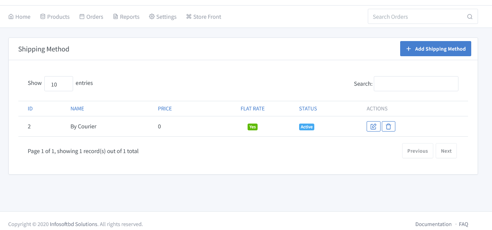
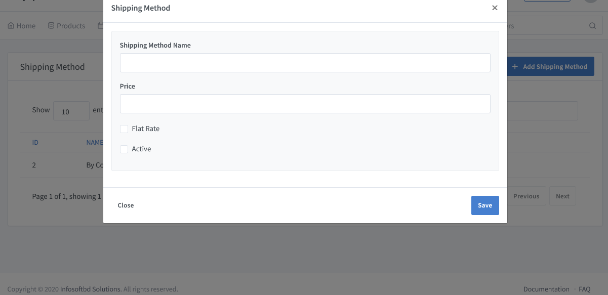

# Shipping Methods Documentation

> If your business sells a physical product, then you need to be able to get that product to your customers. As high delivery fees are the biggest cause of abandoned shopping carts, it’s important to choose the right e-commerce shipping options for your business.

Go to the solution dashboard and click on **"Settings => Shipping Method"** to add different kinds of Shipping methods manually.

Go to the Shipping Method and click on **Add Shipping Method** button.A new window will appear to add a new shipping method and add a shipping charge for each delivery.

