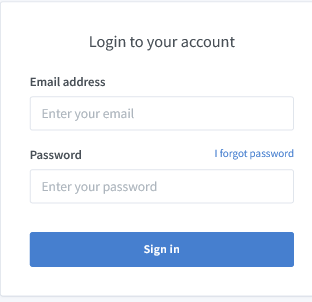
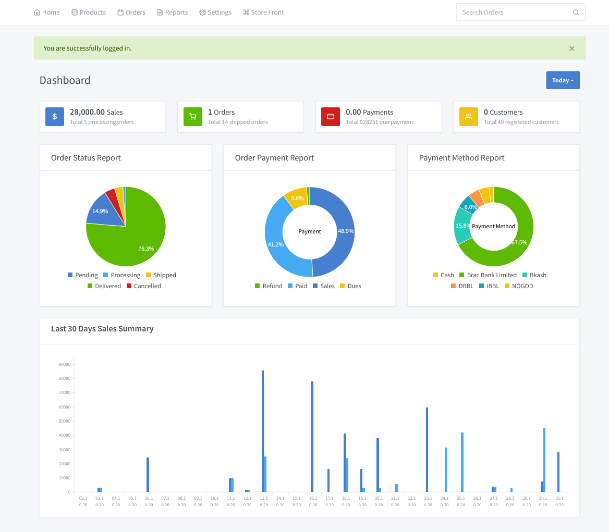

# Logging in to Store

You can log in to your clcknshop account using your internet browser on a desktop device, or a mobile device.

If you forget your store account password, then you can reset your password. If you forget the email address then contact our  Support.

**Steps:**

- Go to the Stores admin login page. Like a https://clckn.shop/admin

- Enter your email address that's  use one of the login services to log in.
- Enter your password, and then click Log in.
- If you have two-step authentication activated on your  account, then enter the authentication code using your authentication method, and then click Log in.
- If you have multiple stores associated to your account, then select the store that you want to access.

After successfully logging in, you can see a dynamic and beautiful dashborad.

