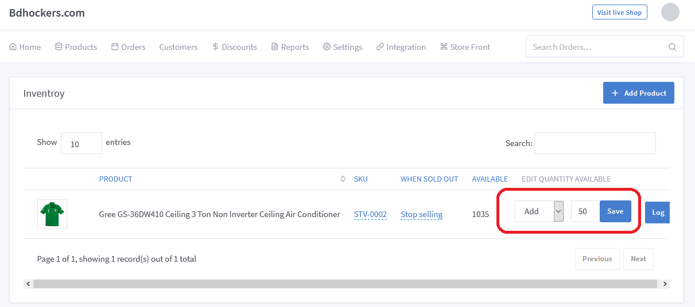

# Stock Adjustment Documentation

> The term "stock management" is the process of controlling and appropriately managing how much stock a company should have at any given time. Stock is part of your inventory. But, not all of your inventory is your stock. It involves all of the procedures associated with ordering, tracking, controlling, and storing inventory. 

**Stock management involves:**

- Tracking variations in your stock
- Monitoring the condition of your stock
- Understanding customer demand for stock
- Determining costs for materials
- Calculate shipping, handling, and delivery costs.

