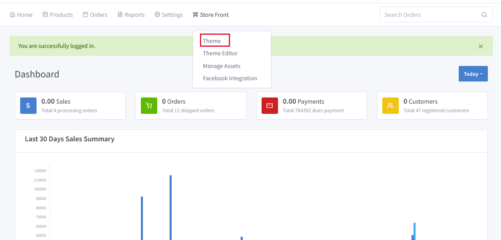
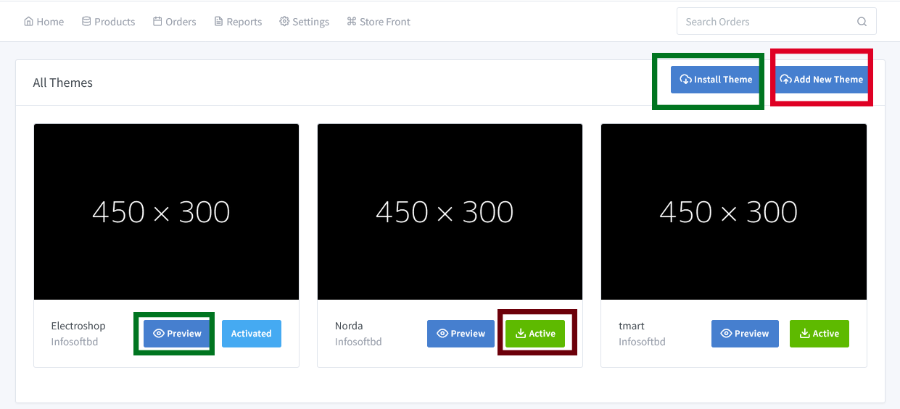
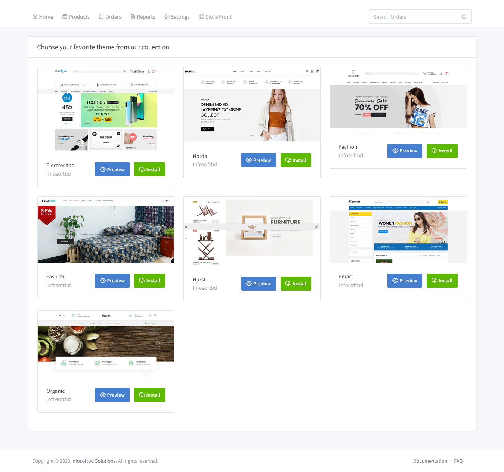
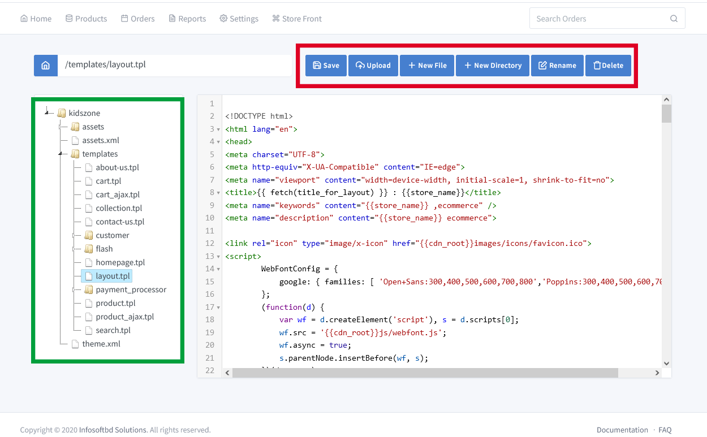

# About Theme 

> Create and setup your ecommerce site without any coding skills.Bring your brand to life with customizable and responsive themes.

Go to the dashboard and click on **"Store Front => Theme"** to install a new development theme or activate an existing theme.

Now let's first select a suitable theme for your store.  Note that under the theme that you like, Live Demo and Install are written. Now if you like, then install it. The theme will become active in your store.

There are few important terms in theme section:

- Install Theme :

Now, if you click on Theme from the dropdown menu, you will get several themes. Note that Live Demo and Install Theme are written below the theme that you like. Click on Live Demo to see how this theme will look. You will see that theme in a new window. Now install it if you like. The theme will be active in your store.

Click on **Settings => General** Option to set the logo, update the store title, and also update your store information. Then click on **Store Front=>Manage assets**, customization of your slider image, home page, nav bar, menu, header, and footer.

- Add New Theme : Now click on **Add New Theme** add your customizable theme.

# Edit/Update Theme

Click on **"Store Front => Theme Editor"**. Update your e-commerce site without any coding skills. Just click and open, then update your site with what you want.It's just like an editor. You can save, upload a new file, create a new file, create a new directory, and rename a file or directory. If you don't need it, you can delete it.

