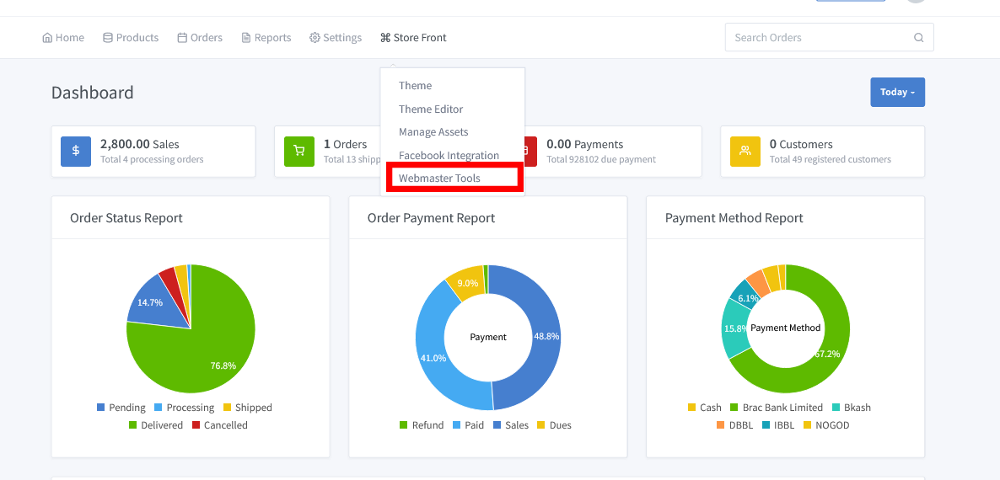
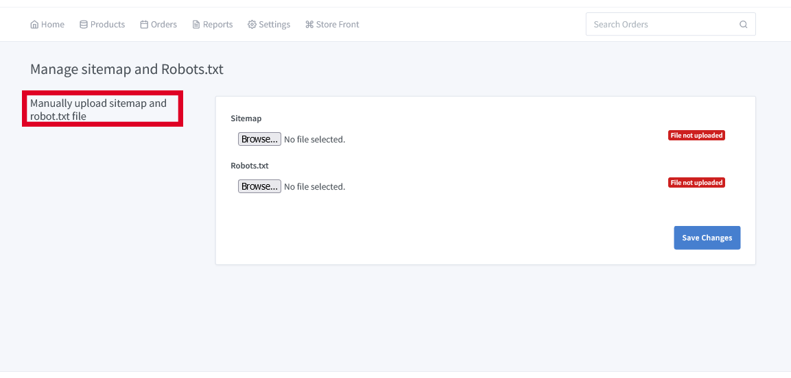
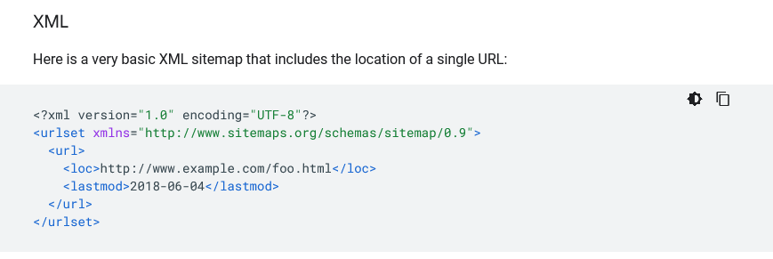
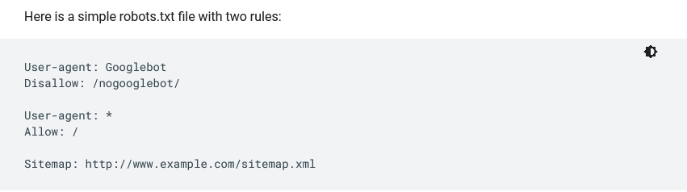

# Webmaster Tools

>Get your site's performance data, take advantage of free SEO tools and analyse insights to improve your page rankings on search results.

Go to our nice and smart dashboard and click on **"Store Front => Webmaster Tools"**. There is an option to upload two.xml files for the sitemap and Robots.xml .

There is an option to upload two.xml files for the sitemap and Robots.xml .

 - Sitemap

 A sitemap lists a website's most important pages, thus, making sure search engines can find and crawl them. Sitemaps also help in understanding your website structure, making it easier to navigate your website.

 **Sitemap formats:**

- XML

- RSS, mRSS, and Atom 1.0

- Text

 - Robots.txt

The robots. txt plays an essential role from a SEO point of view. It tells search engines how they can best crawl your website.

